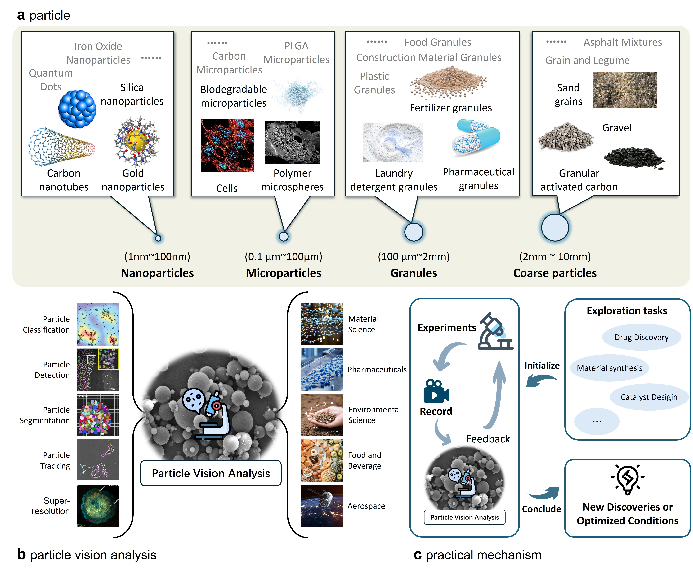

# Awesome-Particle-Vision-Analysis [](https://github.com/sindresorhus/awesome)


**Particle Vision Analysis** (PVA) merges AI-enhanced imaging and computational techniques to study particles across various media, serving as a cornerstone in understanding their complex properties and behaviors. This multidisciplinary field significantly impacts materials science, pharmaceuticals, environmental science, and industrial processing, contributing to the advancement of both technology and science by providing detailed quantitative and qualitative insights into particle size, shape, distribution, composition, and dynamics

> Here, we provide a non-exhaustive list of papers that use AI techniques to analyze and characterize particles in various media.


## 🌟 Introduction

<div align=center></div>


**(a)**, **Particle diversity and industry applications**: Ranging from nanoparticles (1\,nm to 100\,nm) like gold and silica crucial in medical therapies and drug delivery, to microparticles (0.1\,$\mu$m to 100\,$\mu$m) such as polymer spheres and cells important in slow-release medications and biological research. Granules (100\,$\mu$m to 2\,mm), used in sectors from agriculture to cleaning, and coarse particles (2\,mm to 10\,mm) such as sand and gravel, are essential in construction and environmental management.
**(b)**, **Overview of particle vision analysis**: This discipline focuses on the detection, segmentation, tracking, classification, and super-resolution imaging of particles. It utilizes advanced algorithms and imaging techniques to analyze particles ranging from microscopic cell structures to larger environmental samples, with applications spanning materials science, pharmaceuticals, environmental science, food and beverage, and aerospace.
**(c)**, **Scientific discovery and optimization cycle via particle vision analysis**: Initiating with exploration tasks like drug discovery, material synthesis, and catalyst design, this cycle progresses through experimentation where observations and data are gathered and analyzed with advanced particle imaging techniques. The feedback loop from these experiments drives further refinements, enhancing insights or optimizing conditions, thus promoting continuous advancement in various fields.

## 🔧 Tools

Source code and containers for AI-driven particle vision analysis.

| **Application** | **Particle Size** | **Package name and Link** | **Comments** | 
|-----------------|-------------------|---------------------------|--------------|
| Particle Segmentation | Microparticles | [Cellpose](https://github.com/MouseLand/cellpose) | A generalist algorithm for cell and nucleus segmentation. |
| Particle Segmentation | Microparticles or Granules | [qupath](https://github.com/qupath/qupath) | An open source software for bioimage analysis. |[deeptangle](https://github.com/kirkegaardlab/deeptangle) | Fast detection of slender bodies in high-density microscopy data. |
| Particle Detection and Segmentation | Microparticles or Granules | [stardist](https://github.com/stardist/stardist) | A deep learning nuclei segmentation method originally developed for fluorescence microscopy, can be extended and successfully applied to histopathology images. |
| Particle Classification and Segmentation | Microparticles or Granules | [tiatoolbox](https://github.com/TissueImageAnalytics/tiatoolbox) | A computational pathology toolbox developed by TIA Centre that provides an end-to-end API for pathology image analysis using best practices. |
| Particle Segmentation | Microparticles or Granules | [micro-sam](https://github.com/computational-cell-analytics/micro-sam) | A tool for interactive and automatic segmentation and tracking of objects in multi-dimensional microscopy data. |
| Particle Segmentation | Microparticles or Granules | [DeepLIIF](https://github.com/nadeemlab/DeepLIIF) | Deep-Learning inferred multiplex immunofluorescence for immunohistochemical image quantification. |
| Particle Segmentation | Microparticles or Granules | [Spateo](https://github.com/aristoteleo/spateo-release) | Multidimensional spatiotemporal modeling of single-cell spatial transcriptomics. |
| Particle Segmentation | Microparticles or Granules | [MEDIAR](https://github.com/Lee-Gihun/MEDIAR) | Harmony of Data-Centric and Model-Centric for Multi-Modality Microscopy. |
| Particle Tracking | Microparticles or Granules | [BigNeuron](https://github.com/lmanubens/BigNeuron) | A resource to benchmark and predict performance of algorithms for automated tracing of neurons in light microscopy datasets. |
| Particle Tracking | Microparticles or Granules | [Usiigaci](https://github.com/oist/Usiigaci) | An all-in-one, semi-automated pipeline to segment, track, and visualize cell movement and morphological changes in phase contrast microscopy. |
| Particle Tracking | Microparticles or Granules | [TrackMate](https://github.com/trackmate-sc/TrackMate) | An extensible platform where developers can easily write their own detection, particle linking, visualization or analysis algorithms. |
| Particle Tracking | Microparticles or Granules | [DeepTrack2](https://github.com/DeepTrackAI/DeepTrack2) | A comprehensive deep learning framework for digital microscopy. |
| Particle Tracking | Microparticles or Granules | [Bayesian Tracker](https://github.com/quantumjot/btrack) | A Python library for multi-object tracking, used to reconstruct trajectories in crowded fields. |
| Super-Resolution | Nanoparticles or Microparticles | [PSSR](https://github.com/BPHO-Salk/PSSR) | A Deep Learning-based framework that facilitates otherwise unattainable resolution, speed and sensitivity of point-scanning imaging systems (e.g. scanning electron or laser scanning confocal microscopes). |
| Super-Resolution | Nanoparticles or Microparticles | [CAFI](https://github.com/mpriessner/CAFI) | Deep Learning-based temporal super-resolution for fast bioimaging. |
| Super-Resolution | Nanoparticles or Microparticles | [FD-DeepLoc](https://github.com/Li-Lab-SUSTech/FD-DeepLoc) | Field dependent deep learning enables high-throughput whole-cell 3D super-resolution imaging. |
| Super-Resolution | Nanoparticles or Microparticles | [DeepSTORM3D](https://github.com/EliasNehme/DeepSTORM3D) | Dense 3D localization microscopy and PSF design by deep learning. |


## 📚 Paper

### 2024
- Application of Artificial Intelligence in Particle and Impurity Detection and Removal: A Survey. (**IEEE Access** 2024) [[paper]](https://ieeexplore.ieee.org/abstract/document/10385081)

### 2023
- Geometric deep learning reveals the spatiotemporal features of microscopic motion. (**Nature Machine Intelligence** 2023) [[paper]](https://www.nature.com/articles/s42256-022-00595-0)
- u-track3D: Measuring, navigating, and validating dense particle trajectories in three dimensions. (**Cell Reports Methods** 2023) [[paper]](https://www.cell.com/cell-reports-methods/pdf/S2667-2375(23)00326-0.pdf)
- Deep Learning Method for Probabilistic Particle Detection and Tracking in Fluorescence Microscopy Images. (**IEEE 20th International Symposium on Biomedical Imaging (ISBI)** 2023) [[paper]](https://ieeexplore.ieee.org/abstract/document/10230392)
- A Motion Transformer for Single Particle Tracking in Fluorescence Microscopy Images. (**Medical Image Computing and Computer Assisted Intervention** 2023) [[paper]](https://link.springer.com/chapter/10.1007/978-3-031-43993-3_49)

### 2022
- Nanoparticle Detection on SEM Images Using a Neural Network and Semi-Synthetic Training Data. (**Nanomaterials (Basel, Switzerland)** 2022) [[paper]](https://pubmed.ncbi.nlm.nih.gov/35683674/)
- Deep learning detection of nanoparticles and multiple object tracking of their dynamic evolution during in situ ETEM studies. (**Scientific Reports** 2022) [[paper]](https://www.nature.com/articles/s41598-022-06308-2)
- Particle recognition on transmission electron microscopy images using computer vision and deep learning for catalytic applications. (**Catalysts** 2022) [[paper]](https://www.mdpi.com/2073-4344/12/2/135)
- TrackMate 7: integrating state-of-the-art segmentation algorithms into tracking pipelines. (**Nature Methods** 2022) [[paper]](https://www.nature.com/articles/s41592-022-01507-1)
- Deep Neural Network for Combined Particle Tracking and Colocalization Analysis in Two-Channel Microscopy Images. (**IEEE 19th International Symposium on Biomedical Imaging (ISBI)** 2022) [[paper]](https://ieeexplore.ieee.org/abstract/document/9761696)

### 2021
- Multifluorescence Single Extracellular Vesicle Analysis by Time-Sequential Illumination and Tracking. (**ACS Nano** 2021) [[paper]](https://pubs.acs.org/doi/10.1021/acsnano.1c02556)
- Deep probabilistic tracking of particles in fluorescence microscopy images. (**Medical Image Analysis** 2021) [[paper]](https://www.sciencedirect.com/science/article/pii/S1361841521001742)
- Deep Learning For Particle Detection And Tracking In Fluorescence Microscopy Images. (**IEEE 18th International Symposium on Biomedical Imaging (ISBI)** 2021) [[paper]](https://ieeexplore.ieee.org/abstract/document/9433759)

### 2020 
- Overview: Computer vision and machine learning for microstructural characterization and analysis. (**Metallurgical and Materials Transactions A** 2020) [[paper]](https://link.springer.com/article/10.1007/S11661-020-06008-4)
- Nanoparticle recognition on scanning probe microscopy images using computer vision and deep learning. (**Nanomaterials** 2020) [[paper]](https://www.mdpi.com/2079-4991/10/7/1285)
- Towards a Computer Vision Particle Flow. (**The European Physical Journal C** 2020) [[paper]](https://arxiv.org/abs/2003.08863)
- Machine learning for 3D particle tracking in granular gases. (**Microgravity Science and Technology** 2020) [[paper]](https://link.springer.com/article/10.1007/s12217-020-09800-4)
- A Recurrent Neural Network for Particle Tracking in Microscopy Images Using Future Information, Track Hypotheses, and Multiple Detections. (**IEEE Trans Image Process** 2020) [[paper]](https://ieeexplore.ieee.org/stamp/stamp.jsp?arnumber=8957409)
- Multiple Object Tracking for Occluded Particles. (**IEEE Access** 2020) [[paper]](https://ieeexplore.ieee.org/abstract/document/9306807)
- Deep-learning method for data association in particle tracking. (**Bioinformatics** 2020) [[paper]](https://academic.oup.com/bioinformatics/article-abstract/36/19/4935/5867905)


### 2019
- Particle identification in camera image sensors using computer vision. (**Astroparticle Physics** 2019) [[paper]](https://www.sciencedirect.com/science/article/pii/S0927650518300859)
- PIXER: an automated particle-selection method based on segmentation using a deep neural network. (**BMC bioinformatics** 2019) [[paper]](https://link.springer.com/article/10.1186/s12859-019-2614-y)

### 2017
- TrackMate: An open and extensible platform for single-particle tracking. (**Methods** 2017) [[paper]](https://www.sciencedirect.com/science/article/pii/S1046202316303346)
- Single particle tracking: from theory to biophysical applications. (**Chemical reviews** 2017) [[paper]](https://pubs.acs.org/doi/full/10.1021/acs.chemrev.6b00815)

### 2016
- Automated single particle detection and tracking for large microscopy datasets. (**The Royal Society** 2016) [[paper]](https://royalsocietypublishing.org/doi/10.1098/rsos.160225)

### 2015
- A review of progress in single particle tracking: from methods to biophysical insights. (**Reports on progress in physics** 2015) [[paper]](https://iopscience.iop.org/article/10.1088/0034-4885/78/12/124601/meta)

### 2014
- Nanoparticle Characterization Using Nanoparticle Tracking Analysis. (**Nanoparticles' Promises and Risks** 2014) [[paper]](https://link.springer.com/chapter/10.1007/978-3-319-11728-7_13)
- Objective comparison of particle tracking methods. (**Nature methods** 2014) [[paper]](https://www.nature.com/articles/nmeth.2808)

### 2011
- Tracking multiple particles in fluorescence microscopy images via probabilistic data association. (**IEEE International Symposium on Biomedical Imaging: From Nano to Macro** 2011) [[paper]](https://ieeexplore.ieee.org/document/5872786)

### 2008
- Robust single-particle tracking in live-cell time-lapse sequences. (**Nature Methods** 2008) [[paper]](https://www.nature.com/articles/nmeth.1237)

## Citation
If you find our work and this repository useful, please consider giving a star :star: and citation :beer::

```
@misc{chen2024future,
      title={Future Manufacturing with AI-Driven Particle Vision Analysis in the Microscopic World}, 
      author={Guangyao Chen and Fengqi You},
      year={2024},
      archivePrefix={arXiv},
      primaryClass={cs.AI}
}
```

### Contributing
Please help us improve the above listing by submitting PRs of other papers in this space. Thank you!